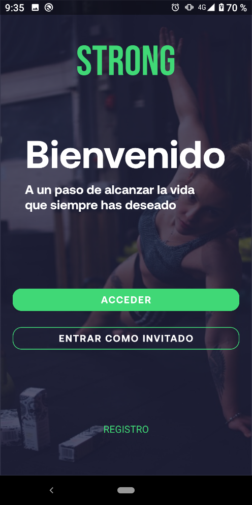

# **APP ASIER ARANDA, MARIO MUÑOZ  Y WILSON CAMACHO**

# --------------- **STRONG** ----------------

Para comenzar vamos a hacer una breve explicación de nuestra app.
Se trata de una app relacionada con el deporte y la vida saludable, la cual se llama ***Strong***

## **1. EXPLICACIÓN DE LA PARTE VISUAL:**

Lo primero que llevamos a cabo fue una selección de una paleta de colores. Nos decantamos por una que tiene un verde bastante llamativo,
el negro, un azul muy oscuro y el negro.

Las imágenes que hemos elegido para utilizarlas de fondo, son imágenes oscuras, para que resalte bien el texto.

A continuación, creamos un logo acorde con nuestra app, elegimos un meteorito con una ***s*** de ***Strong***.

## **2. EXPLICACIÓN DE LAYOUTS:**

## * SplashScreen:

Según abrimos la app, nos encontramos con una ***animación***, la cual está compuesta por el logo de nuestra app y debajo de este
tenemos varias imágenes que van apareciendo una detrás de otra.

Para lograr este efecto hemos usado un tipo de animación llamado ***blink***.

## * Bienvenida:

Tras la secuencia de la animación, llegamos a la ***bienvenida***, en la cual nos aparece el nombre de la app en primer lugar, y dos botones, uno para acceder y otro para entrar como invitado.

También desde este activity tenemos un ***TextView*** con el cual podemos registrarnos, para ello nos llevará a otra página.

## * Registro:

Si pulsamos donde pone ***registro*** en la ventana anterior, accederemos a este punto. Aquí podemos introducir los diferentes datos
en los ***EditText*** que tenemos.

Por último, tenemos un botón para poder guardar nuestros datos y otro para poder volver al login por si nos hemos confundido y ya estabamos registrados.

## * Despues de registrarse:

Tras hacer el registro previo, y dar al botón de registrarse, accederemos a otra página para acabar de rellenar nuestros datos.

Aquí rellenaremos los distintos ***EditText*** que tenemos y también haremos una selección de nuestro sexo y de nnuestro nivel de relación con el deporte
mediante dos ***RadioButtom***.

Cuando ya tengamos todos los datos completados, pulsaremos sobre el botón de aceptar para poder acceder a la parte principal de la app,
en caso de que queramos volver atrás para rellenar algo, pulsaremos el botón de volver atrás.

## * Login:

En el caso de que ya tengamos una cuenta creada y simplemente queramos acceder a la app, pulsaremos el boton de acceder que nos apareció
tras el ***SplashScreen*** y accederemos a una página en la que ingresaremos nuestro usuario y nuestra contraseña para poder acceder.

## * Fragments:

Una vez accedemos a la cuenta, bien porque ya teníamos una cuenta creada o bien porque nos la hemos creado al entrar,
llegaremos al main, parte principal de la app.

Aquí podremos ver una secuencia de 3 fragments, en los cuales deslizando veremos la información que se explica a continuación.

### **--Fragment1:**

En el primer fragment, el home, tenemos una serie de músculos para poder ejercitar nuestras distintas partes del cuerpo.

Estos, están incluidos en ***CardViews*** que a su vez están incluidos en un ***RecyclerView***.

Si pulsamos en un músculo, se nos desplegará un ***AlertDialog*** el cual simula una carta donde podremos ver diferentes ejercicios para el músculo elegido.

### **--Fragment2:**

En el segundo fragment, el de estadísticas, podemos ver una serie de datos los cuales los ha calculado personalizadamente la app
para nosotros mediante una serie de fórmulas y métodos que explicaremos más tarde, usando los datos que hemos introducido al crear la cuenta.

Nos ofrece datos como cuál debería ser nuestro peso ideal, cuantos pasos al día deberíamos dar o cuantas calorías deberíamos quemar al día.

### **--Fragment3:**

En el tercer frament, el de perfil, nos aparecerán nuestros datos, los que hemos introducido al crear la cuenta.

Aquí podremos modificar nuestros datos si hemos sufrido alguna modificación en el cuerpo, como subir o bajar de peso, aumentar nuestra altura...

En este fragment, tenemos un ***AlertDialog***, el cual te avisa que en esta página podrás cambiar los datos.

## **2. EXPLICACIÓN DEL CÓDIGO:**

## * Fragments:

### **--Page1:**

### **--Page2:**

En esta clase, contamos con los siguientes métodos:

***Pasos Diarios:*** dependiendo del género y del nivel de deporte que realices, nos dará unos valores u otros.

En este método también damos valor a la variable ***calQuemar***.

***Kcal a Quemar:*** simplemente llamamos a la variable que hemos dado valor en el método anterior.

***Peso Ideal:*** para calcular esto, utilizamos las variables que tenemos en el perfil, es decir, el género y la altura, y con ellas realizamos la fórmula.

### **--Page:**

## * Fragments:

## * Fragments:

## * Fragments:

## * Fragments:

Prototipo Adobe XD
<<<<<<< HEAD

=======
https://xd.adobe.com/view/ff1fc9eb-0c84-4b65-a7fb-ee32a6205217-aa4c/
>>>>>>> origin/Wilson

Trello
https://trello.com/b/c9nF1cWm/strong

Slack
https://app.slack.com/client/T02R1HKEMDJ/C02RCTLHF3M
